# Open WebUI Tools Collection

[](https://github.com/open-webui/open-webui)
[](https://opensource.org/licenses/MIT)
[](https://www.python.org/)
[](CONTRIBUTING.md)

> **🚀 A modular collection of tools, function pipes, and filters to supercharge your Open WebUI experience.**

Transform your Open WebUI instance into a powerful AI workstation with this comprehensive toolkit. From academic research and image generation to music creation and autonomous agents, this collection provides everything you need to extend your AI capabilities.

## ✨ What's Inside

This repository contains **20+ specialized tools and functions** designed to enhance your Open WebUI experience:

### 🛠️ **Tools**

- **arXiv Search** - Academic paper discovery (no API key required!)
- **Perplexica Search** - Web search using Perplexica API with citations
- **Pexels Media Search** - High-quality photos and videos from Pexels API
- **YouTube Search & Embed** - Search YouTube and play videos in embedded player
- **Native Image Generator** - Direct Open WebUI image generation with Ollama model management
- **Hugging Face Image Generator** - AI-powered image creation
- **ComfyUI Image-to-Image (Qwen Edit 2509)** - Advanced image editing with multi-image support
- **ComfyUI ACE Step 1.5 Audio** - Advanced music generation (New)
- **ComfyUI ACE Step Audio (Legacy)** - Advanced music generation
- **ComfyUI Text-to-Video** - Generate short videos from text using ComfyUI (default WAN 2.2 workflow)
- **Flux Kontext ComfyUI** - Professional image editing
- **OpenWeatherMap Forecast Tool** - Interactive weather widget with current conditions and forecasts

### 🔄 **Function Pipes**

- **Planner Agent v3** - Advanced autonomous agent with agentic planning, multi-agent delegation, and real-time visual execution tracking
- **arXiv Research MCTS** - Advanced research with Monte Carlo Tree Search
- **Multi Model Conversations v2** - Multi-agent discussions with interactive UI, tool support, and improved reasoning handling
- **Resume Analyzer** - Professional resume analysis
- **Mopidy Music Controller** - Music server management
- **Letta Agent** - Autonomous agent integration
- **Perplexica Pipe** - AI-powered web search with streaming responses and citations
- **Google Veo Text-to-Video & Image-to-Video** - Generate videos from text or a single image using Google Veo (only one image supported as input)
- **MiniMax LLM Pipe** - Route chat completions to MiniMax's OpenAI-compatible API with M2.7 and M2.7-highspeed models (204K context)

### 🔧 **Filters**

- **Doodle Paint** - Toggleable filter that opens a paint canvas before sending each message
- **Prompt Enhancer** - Automatic prompt improvement
- **Semantic Router** - Intelligent model selection
- **Full Document** - File processing capabilities
- **Clean Thinking Tags** - Conversation cleanup
- **OpenRouter WebSearch Citations** - Enable web search for OpenRouter models with citation handling

## 🚀 Quick Start

### Option 1: Open WebUI Hub (Recommended)

1. Visit [https://openwebui.com/u/haervwe](https://openwebui.com/u/haervwe)
2. Browse the collection and click "Get" for desired tools
3. Follow the installation prompts in your Open WebUI instance

### Option 2: Manual Installation

1. Copy `.py` files from `tools/`, `functions/`, or `filters/` directories
2. Navigate to Open WebUI Workspace > Tools/Functions/Filters
3. Paste the code, provide a name and description, then save

## 🎯 Key Features

- **🔌 Plug-and-Play**: Most tools work out of the box with minimal configuration
- **🎨 Visual Integration**: Seamless integration with ComfyUI workflows
- **🤖 AI-Powered**: Advanced features like MCTS research and autonomous planning
- **📚 Academic Focus**: arXiv integration for research and academic work
- **🎵 Creative Tools**: Music generation and image editing capabilities
- **🔍 Smart Routing**: Intelligent model selection and conversation management
- **📄 Document Processing**: Full document analysis and resume processing


## 📋 Prerequisites

- **Open WebUI**: Version 0.6.0+ recommended
- **Python**: 3.8 or higher
- **Optional Dependencies**:
  - ComfyUI (for image/music generation tools)
  - Mopidy (for music controller)
  - Various API keys (Hugging Face, Tavily, etc.)

## 🔧 Configuration

Most tools are designed to work with minimal configuration. Key configuration areas:

- **API Keys**: Required for some tools (Hugging Face, Tavily, etc.)
- **ComfyUI Integration**: For image and music generation tools
- **Model Selection**: Choose appropriate models for your use case
- **Filter Setup**: Enable filters in your model configuration

---

## 📖 Detailed Documentation

### Table of Contents

1. [arXiv Search Tool](#arxiv-search-tool)
2. [Perplexica Search Tool](#perplexica-search-tool)
3. [Pexels Media Search Tool](#pexels-media-search-tool)
4. [YouTube Search & Embed Tool](#youtube-search--embed-tool)
5. [Native Image Generator](#native-image-generator)
6. [Hugging Face Image Generator](#hugging-face-image-generator)
7. [Cloudflare Workers AI Image Generator](#cloudflare-workers-ai-image-generator)
8. [SearxNG Image Search Tool](#searxng-image-search-tool)
9. [ComfyUI Image-to-Image Tool (Qwen Image Edit 2509)](#comfyui-image-to-image-tool-qwen-image-edit-2509)
10. [ComfyUI ACE Step 1.5 Audio Tool](#comfyui-ace-step-1-5-audio-tool)
11. [ComfyUI ACE Step Audio Tool (Legacy)](#comfyui-ace-step-audio-tool-legacy)
12. [ComfyUI Text-to-Video Tool](#comfyui-text-to-video-tool)
13. [OpenWeatherMap Forecast Tool](#openweathermap-forecast-tool)
14. [Flux Kontext ComfyUI Pipe](#flux-kontext-comfyui-pipe)
15. [Google Veo Text-to-Video & Image-to-Video Pipe](#google-veo-text-to-video--image-to-video-pipe)
16. [MiniMax LLM Pipe](#minimax-llm-pipe)
17. [Planner Agent v3](#planner-agent-v3)
17. [arXiv Research MCTS Pipe](#arxiv-research-mcts-pipe)
18. [Multi Model Conversations v2 Pipe](#multi-model-conversations-v2-pipe)
19. [Resume Analyzer Pipe](#resume-analyzer-pipe)
20. [Mopidy Music Controller](#mopidy-music-controller)
21. [Letta Agent Pipe](#letta-agent-pipe)
22. [Perplexica Pipe](#perplexica-pipe)
23. [OpenRouter Image Pipe](#openrouter-image-pipe)
24. [OpenRouter WebSearch Citations Filter](#openrouter-websearch-citations-filter)
25. [Doodle Paint Filter](#doodle-paint-filter)
26. [Prompt Enhancer Filter](#prompt-enhancer-filter)
27. [Semantic Router Filter](#semantic-router-filter)
28. [Full Document Filter](#full-document-filter)
29. [Clean Thinking Tags Filter](#clean-thinking-tags-filter)
30. [Using the Provided ComfyUI Workflows](#using-the-provided-comfyui-workflows)
31. [Installation](#installation)
32. [Contributing](#contributing)
33. [License](#license)
34. [Credits](#credits)
35. [Support](#support)
---

## 🧪 Tools

### arXiv Search Tool

### Description

Search arXiv.org for relevant academic papers on any topic. No API key required!

### Configuration

- No configuration required. Works out of the box.

### Usage

- **Example:**

  ```python
  Search for recent papers about "tree of thought"
  ```

- Returns up to 5 most relevant papers, sorted by most recent.


*Example arXiv search result in Open WebUI*

---

### Perplexica Search Tool

### Description

Search the web for factual information, current events, or specific topics using the Perplexica API. This tool provides comprehensive search results with citations and sources, making it ideal for research and information gathering. [Perplexica](https://github.com/ItzCrazyKns/Perplexica) is an open-source AI-powered search engine and alternative to Perplexity AI that must be self-hosted locally. It uses advanced language models to provide accurate, contextual answers with proper source attribution.

### Configuration

- `BASE_URL` (str): Base URL for the Perplexica API (default: `http://host.docker.internal:3001`)
- `OPTIMIZATION_MODE` (str): Search optimization mode - "speed" or "balanced" (default: `balanced`)
- `CHAT_MODEL` (str): Default chat model for search processing (default: `llama3.1:latest`)
- `EMBEDDING_MODEL` (str): Default embedding model for search (default: `bge-m3:latest`)
- `OLLAMA_BASE_URL` (str): Base URL for Ollama API (default: `http://host.docker.internal:11434`)

**Prerequisites**: You must have [Perplexica](https://github.com/ItzCrazyKns/Perplexica) installed and running locally at the configured URL. Perplexica is a self-hosted open-source search engine that requires Ollama with the specified chat and embedding models. Follow the installation instructions in the Perplexica repository to set up your local instance.

### Usage

- **Example:**

  ```python
  Search for "latest developments in AI safety research 2024"
  ```

- Returns comprehensive search results with proper citations

- Automatically emits citations for source tracking in Open WebUI

- Provides both summary and individual source links

### Features

- **Web Search Integration**: Direct access to current web information
- **Citation Support**: Automatic citation generation for Open WebUI
- **Model Flexibility**: Configurable chat and embedding models
- **Real-time Status**: Progress updates during search execution
- **Source Tracking**: Individual source citations with metadata

---

### Pexels Media Search Tool

### Description

Search and retrieve high-quality photos and videos from the Pexels API. This tool provides access to Pexels' extensive collection of free stock photos and videos, with comprehensive search capabilities, automatic citation generation, and direct image display in chat. Perfect for finding professional-quality media for presentations, content creation, or creative projects.

### Configuration

- `PEXELS_API_KEY` (str): Free Pexels API key from https://www.pexels.com/api/ (required)
- `DEFAULT_PER_PAGE` (int): Default number of results per search (default: 5, recommended for LLMs)
- `MAX_RESULTS_PER_PAGE` (int): Maximum allowed results per page (default: 15, prevents overwhelming LLMs)
- `DEFAULT_ORIENTATION` (str): Default photo orientation - "all", "landscape", "portrait", or "square" (default: "all")
- `DEFAULT_SIZE` (str): Default minimum photo size - "all", "large" (24MP), "medium" (12MP), or "small" (4MP) (default: "all")

**Prerequisites**: Get a free API key from [Pexels API](https://www.pexels.com/api/) and configure it in the tool's Valves settings.

### Usage

- **Photo Search Example:**

  ```python
  Search for photos of "modern office workspace"
  ```

- **Video Search Example:**

  ```python
  Search for videos of "ocean waves at sunset"
  ```

- **Curated Photos Example:**

  ```python
  Get curated photos from Pexels
  ```

### Features

- **Three Search Functions**: `search_photos`, `search_videos`, and `get_curated_photos`
- **Direct Image Display**: Images are automatically formatted with markdown for immediate display in chat
- **Advanced Filtering**: Filter by orientation, size, color, and quality
- **Attribution Support**: Automatic citation generation with photographer credits
- **Rate Limit Handling**: Built-in error handling for API limits and invalid keys
- **LLM Optimized**: Results are limited and formatted to prevent overwhelming language models
- **Real-time Status**: Progress updates during search execution

---

### YouTube Search & Embed Tool

### Description

Search YouTube for videos and display them in a beautiful embedded player directly in your Open WebUI chat. This tool provides comprehensive YouTube search capabilities with automatic citation generation, detailed video information, and a custom-styled embedded player. Perfect for finding tutorials, music videos, educational content, or any video content you need.

### Configuration

- `YOUTUBE_API_KEY` (str): YouTube Data API v3 key from https://console.cloud.google.com/apis/credentials (required)
- `MAX_RESULTS` (int): Maximum number of search results to return (default: 5, range: 1-10)
- `SHOW_EMBEDDED_PLAYER` (bool): Show embedded YouTube player for the first result (default: `True`)
- `REGION_CODE` (str): Region code for search results, e.g., "US", "GB", "JP" (default: "US")
- `SAFE_SEARCH` (str): Safe search filter - "none", "moderate", or "strict" (default: "moderate")

**Prerequisites**: Get a free YouTube Data API v3 key from [Google Cloud Console](https://console.cloud.google.com/apis/credentials) and enable the YouTube Data API v3 in your project.

### Usage

- **Search for Videos:**

  ```python
  Search YouTube for "python tutorial for beginners"
  ```

- **Play Specific Video:**

  ```python
  Play YouTube video dQw4w9WgXcQ
  ```

- **Search with Custom Results:**

  ```python
  Search YouTube for "cooking recipes" with 10 results
  ```

### Features

- **Two Main Functions**: `search_youtube` for searching and `play_video` for playing specific video IDs
- **Embedded Player**: Beautiful custom-styled YouTube player embedded directly in chat with responsive design
- **Safe Search**: Built-in content filtering options
- **Region Support**: Localized search results based on region code
- **Direct Links**: Provides YouTube links and "Watch on YouTube" buttons
- **Rate Limit Handling**: Proper error handling for API quota limits
- **Real-time Status**: Progress updates during search and loading

### Getting Started

1. **Get a YouTube API Key:**
   - Visit [Google Cloud Console](https://console.cloud.google.com/)
   - Create a new project or select an existing one
   - Enable the "YouTube Data API v3"
   - Create credentials (API Key)
   - Copy the API key

2. **Configure the Tool:**
   - Open the tool's Valves settings in Open WebUI
   - Paste your API key into the `YOUTUBE_API_KEY` field
   - Adjust other settings as desired (region, max results, etc.)

3. **Start Searching:**
   - Use natural language: "Search YouTube for [topic]"
   - Or use the function directly: `search_youtube("topic")`


*Example of YouTube video embedded in Open WebUI chat*

---

### Native Image Generator

### Description

Generate images using Open WebUI's native image generation middleware configured in admin settings. This tool leverages whatever image generation backend you have configured (such as AUTOMATIC1111, ComfyUI, or OpenAI DALL-E) through Open WebUI's built-in image generation system, with optional Ollama model management to free up VRAM when needed.

### Configuration

- `unload_ollama_models` (bool): Whether to unload all Ollama models from VRAM before generating images (default: `False`)
- `ollama_url` (str): Ollama API URL for model management (default: `http://host.docker.internal:11434`)
- `emit_embeds` (bool): Whether to emit HTML image embeds via the `embeds` event so generated images are displayed inline in the chat (default: `True`). When `False`, the tool will skip emitting embeds and only return bare download URLs. If `emit_embeds` is `True` but no event emitter is available, images cannot be displayed inline and only the URLs will be returned.

**Prerequisites**: You must have image generation configured in Open WebUI's admin settings under Settings > Images. This tool works with any image generation backend you have set up (AUTOMATIC1111, ComfyUI, OpenAI, etc.).

### Usage

- **Example:**

  ```python
  Generate an image of "a serene mountain landscape at sunset"
  ```

- Uses whatever image generation backend is configured in Open WebUI admin settings

- Automatically manages model resources if Ollama unloading is enabled

- Returns markdown-formatted image links for immediate display

### Features

- **Native Integration**: Uses Open WebUI's native image generation middleware without external dependencies
- **Backend Agnostic**: Works with any image generation backend configured in admin settings (AUTOMATIC1111, ComfyUI, OpenAI, etc.)
- **Memory Management**: Optional Ollama model unloading to optimize VRAM usage
- **Flexible Model Support**: You can prompt de agent to change the image generation model, providing the name is given to it.
- **Real-time Status**: Provides generation progress updates via event emitter
- **Error Handling**: Comprehensive error reporting and recovery

---

## Hugging Face Image Generator

### Description

Generate high-quality images from text descriptions using Hugging Face's Stable Diffusion models.

### Configuration

- **API Key** (Required): Obtain a Hugging Face API key from your HuggingFace account and set it in the tool's configuration in Open WebUI.
- **API URL** (Optional): Uses Stability AI's SD 3.5 Turbo model as default. Can be customized to use other HF text-to-image model endpoints.

### Usage

- **Example:**

  ```python
  Create an image of "beautiful horse running free"
  ```

- Multiple image format options: Square, Landscape, Portrait, etc.


*Example image generated with Hugging Face tool*

---

### Cloudflare Workers AI Image Generator

### Description

Generate images using Cloudflare Workers AI text-to-image models, including FLUX, Stable Diffusion XL, SDXL Lightning, and DreamShaper LCM. This tool provides model-specific prompt preprocessing, parameter optimization, and direct image display in chat. It supports fast and high-quality image generation with minimal configuration.

### Configuration

- `cloudflare_api_token` (str): Your Cloudflare API Token (required)
- `cloudflare_account_id` (str): Your Cloudflare Account ID (required)
- `default_model` (str): Default model to use (e.g., `@cf/black-forest-labs/flux-1-schnell`)

**Prerequisites**: Obtain a Cloudflare API Token and Account ID from your Cloudflare dashboard. No additional dependencies beyond `requests`.

### Usage

- **Example:**

  ```python
  # Generate an image with a prompt
  await tools.generate_image(prompt="A futuristic cityscape at sunset, vibrant colors")
  ```

- Returns a markdown-formatted image link for immediate display in chat.

### Features

- **Multiple Models:** Supports FLUX, SDXL, SDXL Lightning, DreamShaper LCM
- **Prompt Optimization:** Automatic prompt enhancement for best results per model
- **Parameter Handling:** Smart handling of steps, guidance, negative prompts, and size
- **Direct Image Display:** Returns markdown image links for chat
- **Error Handling:** Comprehensive error and status reporting
- **Real-time Status:** Progress updates via event emitter

---

### SearxNG Image Search Tool

### Description

Search and retrieve images from the web using a self-hosted [SearxNG](https://searxng.org/) instance. This tool provides privacy-respecting, multi-engine image search with direct image display in chat. Ideal for finding diverse images from multiple sources without tracking or ads.

### Configuration

- `SEARXNG_ENGINE_API_BASE_URL` (str): The base URL for the SearxNG search engine API (default: `http://searxng:4000/search`)
- `MAX_RESULTS` (int): Maximum number of images to return per search (default: 5)

**Prerequisites**: You must have a running SearxNG instance. See [SearxNG documentation](https://docs.searxng.org/) for setup instructions.

### Usage

- **Example:**

  ```python
  # Search for images of cats
  await tools.search_images(query="cats", max_results=3)
  ```

- Returns a list of markdown-formatted image links for immediate display in chat.

### Features

- **Privacy-Respecting:** No tracking, ads, or profiling
- **Multi-Engine:** Aggregates results from multiple search engines
- **Direct Image Display:** Images are formatted for chat display
- **Customizable:** Choose engines, result count, and more
- **Error Handling:** Handles connection and search errors gracefully

---

## 🔄 Function Pipes

### Perplexica Pipe

### Description

AI-powered web search using Perplexica with streaming responses, intelligent citations, and comprehensive source tracking. This function pipe integrates with your self-hosted Perplexica instance to provide real-time web search capabilities with proper source attribution, making it perfect for research, fact-checking, and staying up-to-date with current events.

### Configuration

- `enable_perplexica` (bool): Enable or disable Perplexica search (default: `True`)
- `perplexica_api_url` (str): Perplexica API endpoint (default: `http://localhost:3001/api/search`)
- `perplexica_chat_provider` (str): Provider ID for chat model (default: `550e8400-e29b-41d4-a716-446655440000`)
- `perplexica_chat_model` (str): Chat model to use (default: `gpt-4o-mini`)
- `perplexica_embedding_provider` (str): Provider ID for embeddings (default: `550e8400-e29b-41d4-a716-446655440000`)
- `perplexica_embedding_model` (str): Embedding model to use (default: `text-embedding-3-large`)
- `perplexica_focus_mode` (str): Search focus mode (default: `webSearch`)
- `perplexica_optimization_mode` (str): Optimization mode - "speed" or "balanced" (default: `balanced`)
- `task_model` (str): Model for non-search tasks (default: `gpt-4o-mini`)
- `max_history_pairs` (int): Maximum conversation history pairs to include (default: 12)
- `perplexica_timeout_ms` (int): HTTP socket read timeout in milliseconds (default: 1500)

**Prerequisites**: You must have [Perplexica](https://github.com/ItzCrazyKns/Perplexica) installed and running locally. Perplexica is an open-source AI-powered search engine that requires setup with Ollama or OpenAI-compatible providers.

### Usage

- **Example:**

  ```
  Investigate the latest news on AI regulation for different areas US europe , china, etc, do only one tool call
  ```

- Automatically routes search queries to Perplexica
- Provides streaming responses with real-time updates
- Emits citations with source metadata for each result
- Handles conversation history for contextual searches

### Features

- **Streaming Support**: Real-time streaming responses for faster interaction
- **Smart Citations**: Automatic citation generation with metadata (title, URL, content)
- **Conversation History**: Maintains context from previous messages (configurable)
- **Multiple Focus Modes**: webSearch, academicSearch, youtubeSearch, and more
- **Status Updates**: Real-time progress updates during search
- **Source Tracking**: Comprehensive source metadata with URLs and snippets
- **Task Routing**: Intelligent routing between search and non-search tasks
- **Error Handling**: Robust error handling with user-friendly messages

### Getting Started

1. **Install Perplexica:**
   - Follow the [Perplexica installation guide](https://github.com/ItzCrazyKns/Perplexica)
   - Set up your chat and embedding providers (Ollama, OpenAI, etc.)
   - Start the Perplexica server (default: http://localhost:3001)

2. **Configure the Pipe:**
   - Open the pipe's Valves settings in Open WebUI
   - Set `perplexica_api_url` to your Perplexica instance URL
   - Configure your chat and embedding providers/models
   - Adjust focus mode and optimization settings as needed

3. **Start Searching:**
   - Select the "Perplexica Pipe" model in Open WebUI
   - Ask questions or request web searches
   - View results with automatic citations and source links


*Example of Perplexica pipe search results with citations in Open WebUI*
---

### ComfyUI Image-to-Image Tool (Qwen Image Edit 2509)

### Description

Edit and transform images using ComfyUI workflows with AI-powered image editing. Features the **Qwen Image Edit 2509** model as default, supporting up to 3 images for advanced editing with context, style transfer, and multi-image blending. Also includes Flux Kontext workflow for artistic transformations. Images are automatically extracted from message attachments and rendered as beautiful HTML embeds.

### Configuration

- `comfyui_api_url` (str): ComfyUI HTTP API endpoint (default: `http://localhost:8188`)
- `workflow_type` (str): Choose your workflow—"Flux_Kontext", "QWen_Edit", or "Custom" (default: `QWen_Edit`)
- `custom_workflow` (Dict): Custom ComfyUI workflow JSON (only used when workflow_type='Custom')
- `max_wait_time` (int): Maximum wait time in seconds for job completion (default: `600`)
- `unload_ollama_models` (bool): Automatically unload Ollama models from VRAM before generating images (default: `False`)
- `ollama_api_url` (str): Ollama API URL for model management (default: `http://localhost:11434`)
- `return_html_embed` (bool): Return a beautiful HTML image embed with comparison view (default: `True`)

**Prerequisites**: You must have ComfyUI installed and running with the required models and custom nodes:
- For **Flux Kontext**: Flux Dev model, Flux Kontext LoRA, and required ComfyUI nodes
- For **Qwen Edit 2509**: Qwen Image Edit 2509 model, Qwen CLIP, VAE, and ETN_LoadImageBase64 custom node
- See the [Extras](Extras/) folder for workflow JSON files: `flux_context_owui_api_v1.json` and `image_qwen_image_edit_2509_api_owui.json`

### Usage

- **Example:**

  ```python
  # Attach image(s) and provide editing instructions
  "Remove the background"
  "Change car to red"
  "Apply lighting from first image to second image"
  ```

### Features

- **Qwen Edit 2509 (Default)**: State-of-the-art image editing with precise control and instruction-following
- **Multi-Image Support**: Qwen Edit workflow accepts 1-3 images for advanced editing with context and style transfer
- **Dual Workflow Support**: Switch to Flux Kontext for artistic transformations and creative reimagining
- **Automatic Image Handling**: Images are extracted from messages and passed to the AI automatically
- **VRAM Management**: Optional Ollama model unloading to free GPU memory before generation
- **Beautiful HTML Embeds**: Displays results with elegant before/after comparison view
- **OpenWebUI Integration**: Automatically uploads generated images to OpenWebUI storage
- **Flexible Workflows**: Use built-in workflows or provide your own custom ComfyUI JSON

### Workflow Details

**Qwen Edit 2509 (Default):**
- Supports 1-3 images with multi-image context and style transfer
- Lightning-fast 4-step generation
- Best for: precise edits, object manipulation, style transfer

**Flux Kontext (Alternative):**
- Single image input (multi-image support planned)
- 20-step high-quality generation
- Best for: artistic transformations, creative reimagining

**Custom Workflow:**
- Bring your own ComfyUI workflow JSON
- Full flexibility for advanced users

### Getting Started

1. **Set up ComfyUI:**
   - Install [ComfyUI](https://github.com/comfyanonymous/ComfyUI)
   - Download required models (Flux Dev, Qwen Edit 2509, etc.)
   - Install necessary custom nodes (especially `ETN_LoadImageBase64` for Qwen workflow)

2. **Import workflows:**
   - Load `Extras/flux_context_owui_api_v1.json` or `Extras/image_qwen_image_edit_2509_api_owui.json` in ComfyUI
   - Verify all nodes are recognized (install missing custom nodes if needed)

3. **Configure the tool:**
   - Set `comfyui_api_url` to your ComfyUI server address
   - Choose your preferred workflow type
   - Optionally enable Ollama model unloading if you have limited VRAM

4. **Start editing:**
   - Attach an image (or up to 3 for multi-image editing) to your message
   - Describe your desired transformation in natural language
   - Watch the magic happen!

**Note for Custom Workflows:** If you're using a custom workflow with different capabilities (e.g., single-image only or different prompting requirements), you should modify the `edit_image` function's docstring in the tool code. The docstring instructs the AI on how to use the tool and what prompting strategies work best. Adjust it to match your workflow's specific capabilities and requirements.

**Multi-Image Support Status:**
- **Qwen Edit 2509**: Full support for 1-3 images (default workflow)
- **Flux Kontext**: Single image currently; multi-image support planned for future release
- **Custom workflows**: Depends on your workflow implementation


*Example of Qwen Image Edit 2509 transforming a cyberpunk dolphin into a natural mountain scene*

---

### ComfyUI ACE Step 1.5 Audio Tool

### Description

Generate high-quality music using the improved ACE Step 1.5 model via ComfyUI. This tool builds upon the legacy version with enhanced control over musical elements like key, time signature, BPM, and language. It features the same beautiful embedded player and supports batch generation.

### Configuration

- `comfyui_api_url` (str): ComfyUI API endpoint (default: `http://localhost:8188`)
- `model_name` (str): ACE Step 1.5 checkpoint name (default: `ace_step_1.5_turbo_aio.safetensors`)
- `batch_size` (int): Number of tracks to generate per request (default: `1`)
- `max_duration` (int): Maximum song duration in seconds (default: `180`)
- `max_number_of_steps` (int): Maximum allowed sampling steps (default: `50`)
- `max_wait_time` (int): Max wait time for generation in seconds (default: `600`)
- `workflow_json` (str): ComfyUI Workflow JSON (default: `ace_step_1.5_workflow`)
- `checkpoint_node` (str): Node ID for CheckpointLoaderSimple (default: `"97"`)
- `text_encoder_node` (str): Node ID for TextEncodeAceStepAudio1.5 (default: `"94"`)
- `empty_latent_node` (str): Node ID for EmptyAceStep1.5LatentAudio (default: `"98"`)
- `sampler_node` (str): Node ID for KSampler (default: `"3"`)
- `save_node` (str): Node ID for SaveAudioMP3 (default: `"104"`)
- `vae_decode_node` (str): Node ID for VAEDecodeAudio (default: `"18"`)
- `unload_node` (str): Node ID for UnloadAllModels (default: `"105"`)
- `owui_base_url` (str): Open WebUI base URL (default: `http://localhost:3000`)
- `save_local` (bool): Save generated audio to local storage (default: `True`)
- `show_player_embed` (bool): Show the embedded audio player (default: `True`)
- `unload_comfyui_models` (bool): Unload models after generation using ComfyUI-Unload-Model node (default: `False`)

### Prerequisites

- **ComfyUI-Unload-Model Node**: To use the model unloading feature (`unload_comfyui_models`), you must install the [ComfyUI-Unload-Model](https://github.com/SeanScripts/ComfyUI-Unload-Model) custom node in your ComfyUI instance.

  > **Note**: You can use other model unloading nodes in a custom workflow, but you must correctly configure the `unload_node` valve with the ID of that node.

### User Configuration (Per-User Valves)

Users can customize these settings for their individual sessions by clicking the "Valves" icon in the chat interface:

- `generate_audio_codes` (bool): Enable/disable audio code generation. Disabling it (Fast Mode) speeds up generation but may reduce quality (default: `True`)
- `steps` (int): Number of sampling steps for generation. Higher values may improve quality but take longer (default: `8`, capped by Admin `max_number_of_steps`)
- `seed` (int): Random seed for generation. Set to `-1` for random, or a specific number for reproducible results (default: `-1`)

### Usage

- **Example:**

  ```python
  Generate a "cyberpunk, darkwave" song about "AI takeover" in E minor, 140 BPM, duration 60s
  ```

- **Advanced Features:**


*ACE Step 1.5 Audio Player*

  - Control Key Scale (e.g., "C Major", "F# Minor")
  - Set Time Signature (e.g., 4/4, 3/4)
  - Choose Language (e.g., "en", "ja", "zh")

### Features

- **New in 1.5**: Key scale, time signature, language support, and improved audio quality
- **Batch Generation**: Generate multiple variations at once
- **Embedded Player**: Sleek, transparent player with lyrics and waveform visualization
- **Customizable**: Full control over generation parameters

---

### ComfyUI ACE Step Audio Tool (Legacy)

### Description

Generate music using the ACE Step AI model via ComfyUI. This tool lets you create songs from tags and lyrics, with full control over the workflow JSON and node numbers. Features a beautiful, transparent custom audio player with play/pause controls, progress tracking, volume adjustment, and a clean scrollable lyrics display. Designed for advanced music generation and can be customized for different genres and moods.

### Configuration

- `comfyui_api_url` (str): ComfyUI API endpoint (e.g., `http://localhost:8188`)
- `model_name` (str): Model checkpoint to use (default: `ACE_STEP/ace_step_v1_3.5b.safetensors`)
- `workflow_json` (str): Full ACE Step workflow JSON as a string. Use `{tags}`, `{lyrics}`, and `{model_name}` as placeholders.
- `tags_node` (str): Node number for the tags input (default: `"14"`)
- `lyrics_node` (str): Node number for the lyrics input (default: `"14"`)
- `model_node` (str): Node number for the model checkpoint input (default: `"40"`)
- `save_local` (bool): Copy the generated song to Open WebUI storage backend (default: `True`)
- `owui_base_url` (str): Your Open WebUI base URL (default: `http://localhost:3000`)
- `show_player_embed` (bool): Show the embedded audio player. If false, only returns download link (default: `True`)

### Usage

1. **Import the ACE Step workflow:**
   - In ComfyUI, go to the workflow import section and load `extras/ace_step_api.json`.
   - Adjust nodes as needed for your setup.
2. **Configure the tool in Open WebUI:**
   - Set the `comfyui_api_url` to your ComfyUI backend.
   - Paste the workflow JSON (from the file or your own) into `workflow_json`.
   - Set the correct node numbers if you modified the workflow.
3. **Generate music:**
   - Provide a song title, tags, and (optionally) lyrics.
   - The tool will return either an embedded audio player or a download link based on your configuration.

- **Example:**

  ```python
    Generate a song About Ai and Humanity friendship
  ```


*The sleek, transparent audio player embedded in Open WebUI chat*

### Features

- **Custom Audio Player**: Beautiful, semi-transparent player with blur effects
- **Full Playback Controls**: Play/pause, seek, volume control with SVG icons
- **Song Title Display**: User-defined song titles prominently shown
- **Scrollable Lyrics**: Clean lyrics display with custom scrollbar (max 120px height)
- **Transparent UI**: Integrates seamlessly with any Open WebUI theme
- **Toggle Player**: Option to show/hide player embed and just return download links
- **Local Storage**: Optionally saves songs to Open WebUI cache for persistence

*Returns an embedded audio player with download link or just the link, depending on configuration. Advanced users can fully customize the workflow for different genres, moods, or creative experiments.*

---

### ComfyUI Text-to-Video Tool

### Description

Generate short videos from text prompts using a ComfyUI workflow that defaults to the WAN 2.2 text-to-video models. This tool wraps the ComfyUI HTTP + WebSocket API, waits for the job to complete, extracts the produced video, and (optionally) uploads it to Open WebUI storage so it can be embedded in chat.

The default workflow file included in this repository is `extras/video_wan2_2_14B_t2v.json` and the tool implementation lives at `tools/text_to_video_comfyui_tool.py`.

### Configuration

- `comfyui_api_url` (str): ComfyUI HTTP API endpoint (default: `http://localhost:8188`)
- `prompt_node_id` (str): Node ID in the workflow that receives the text prompt (default: `"89"`)
- `workflow` (json/dict): ComfyUI workflow JSON; if empty the bundled WAN 2.2 workflow is used
- `max_wait_time` (int): Maximum seconds to wait for the ComfyUI run (default: `600`)
- `unload_ollama_models` (bool): Whether to unload Ollama models from VRAM before running (default: `False`)
- `ollama_api_url` (str): Ollama API URL used when unloading models (default: `http://localhost:11434`)

### Usage

1. **Import the workflow**
  - In ComfyUI, import the workflow JSON `extras/video_wan2_2_14B_t2v.json` if you want to inspect or modify nodes.
2. **Install / Configure the tool**
  - Copy `tools/text_to_video_comfyui_tool.py` into your Open WebUI tools and set the `comfyui_api_url` and other valves as needed in the tool settings.
3. **Generate a video**
  - Call the tool with a prompt (e.g. "A cyberpunk panda skating through neon streets, 3s shot") and wait for the job to complete. The tool emits progress events and will provide an embedded HTML  player or a direct ComfyUI URL.

**Example:**

```
Generate a 3 second shot of "a cyberpunk panda skating through neon city streets" using the default WAN 2.2 workflow
```


*Example short video generated via ComfyUI WAN 2.2 workflow (thumbnail).* 

### Features

- Uses WAN 2.2 text-to-video model workflow by default (`video_wan2_2_14B_t2v.json`)
- Submits workflow to ComfyUI and listens on WebSocket for completion
- Extracts produced video files and optionally uploads them to Open WebUI storage for inline embedding
- Optional Ollama VRAM unloading to free memory before runs
- Configurable prompt node and wait timeout

---

### OpenWeatherMap Forecast Tool

### Description

Tool that fetches weather forecasts using the OpenWeatherMap API and displays an interactive HTML weather widget with current conditions, hourly, and daily forecasts. Supports both the free 2.5 API and the premium One Call 3.0 API.

### Configuration

- `openweathermap_api_key` (str): Your OpenWeatherMap API key (required)
- `api_version` (str): API version: '2.5' (free, includes current + 5-day/3h forecast) or '3.0' (One Call API, requires separate subscription) (default: `2.5`)
- `units` (str): Units of measurement: 'metric', 'imperial', or 'standard' (default: `metric`)
- `language` (str): Language code for weather descriptions (default: `en`)
- `show_weather_embed` (bool): Show the embedded weather widget (default: `True`)

### Usage

- **Example:**

  ```python
  What is the weather like in Tokyo, JP?
  ```

- Fetches current conditions, hourly forecast, and multi-day daily forecast
- Displays an interactive weather widget and returns a text summary for the LLM

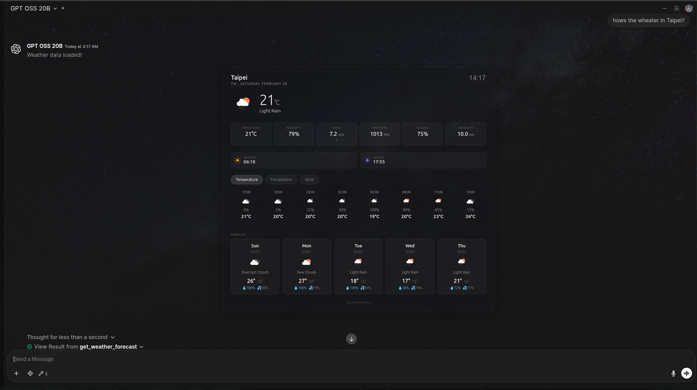
*Example OpenWeatherMap Forecast Tool widget*

---

## 🔄 Function Pipes

### Flux Kontext ComfyUI Pipe

### Description

A pipe that connects Open WebUI to the **Flux Kontext** image-to-image editing model through ComfyUI. This integration allows for advanced image editing, style transfers, and other creative transformations using the Flux Kontext workflow. Features an interactive `/setup` command system for easy configuration by administrators.

### Configuration

The pipe includes an interactive setup system that allows administrators to configure all settings through chat commands. Most configuration can be done using the `/setup` command, which provides an interactive form for easy adjustment of parameters.

**Key Configuration Options:**

- **COMFYUI_ADDRESS**: Address of the running ComfyUI server (default: `http://127.0.0.1:8188`)
- **COMFYUI_WORKFLOW_JSON**: The entire ComfyUI workflow in JSON format
- **PROMPT_NODE_ID**: Node ID for text prompt input (default: `"6"`)
- **IMAGE_NODE_ID**: Node ID for Base64 image input (default: `"196"`)
- **KSAMPLER_NODE_ID**: Node ID for the sampler node (default: `"194"`)
- **ENHANCE_PROMPT**: Enable vision model-based prompt enhancement (default: `False`)
- **VISION_MODEL_ID**: Vision model to use for prompt enhancement
- **UNLOAD_OLLAMA_MODELS**: Free RAM by unloading Ollama models before generation (default: `False`)
- **MAX_WAIT_TIME**: Maximum wait time for generation in seconds (default: `1200`)
- **AUTO_CHECK_MODEL_LOADER**: Auto-detect model loader type for .safetensors or .gguf (default: `False`)

### Usage

#### Initial Setup

1. **Import the workflow:**
   - In ComfyUI, import `extras/flux_context_owui_api_v1.json` as a workflow
   - Adjust node IDs if you modify the workflow

2. **Configure using /setup command (Admin only):**
   - Type `/setup` in the chat to launch the interactive configuration form
   - The form will display all current settings with input fields
   - Adjust any settings you need to change
   - Submit the form to apply and optionally save the configuration
   - Settings can be persisted to a backend config file for permanent storage

3. **Alternative: Manual configuration:**
   - Access the pipe's Valves in Open WebUI's admin panel
   - Set `COMFYUI_ADDRESS` to your ComfyUI backend
   - Paste the workflow JSON into `COMFYUI_WORKFLOW_JSON`
   - Configure node IDs and other parameters as needed

#### Using the Pipe

1. **Basic image editing:**
   - Upload an image to the chat
   - Provide a text prompt describing the desired changes
   - The pipe processes the image through ComfyUI and returns the edited result

2. **Enhanced prompts (optional):**
   - Enable `ENHANCE_PROMPT` in settings
   - Set a `VISION_MODEL_ID` (e.g., a multimodal model like LLaVA or GPT-4V)
   - The vision model will analyze the input image and automatically refine your prompt for better results

3. **Memory management:**
   - Enable `UNLOAD_OLLAMA_MODELS` to free RAM before generation
   - The default workflow includes a `Clean VRAM` node for VRAM management in ComfyUI

**Example - Image editing:**

```
Prompt: "Edit this image to look like a medieval fantasy king, preserving facial features."
[Upload image]
```


*Example of Flux Kontext /setup command interface*


*Example of Flux Kontext image editing output*


---

### MiniMax LLM Pipe

### Description

Route chat completions to [MiniMax](https://platform.minimaxi.com)'s OpenAI-compatible API (`api.minimax.io/v1`) directly from Open WebUI. This pipe exposes MiniMax-M2.7 and MiniMax-M2.7-highspeed models (both with 204K context windows) as selectable models in your Open WebUI instance.

### Configuration

- `MINIMAX_API_KEY` (str): Your MiniMax API key (required, get one at https://platform.minimaxi.com)
- `ENABLED_MODELS` (list): Which MiniMax models to expose (default: all)
- `STRIP_THINKING` (bool): Strip `<think>…</think>` blocks from responses (default: `True`)
- `DEFAULT_TEMPERATURE` (float): Default temperature when none is specified, 0.01–1.0 (default: `0.7`)

**Prerequisites**: Get a MiniMax API key from [MiniMax Platform](https://platform.minimaxi.com).

### Usage

1. **Install the pipe**: Copy `functions/minimax_pipe.py` into Open WebUI via Workspace > Functions
2. **Configure**: Set your `MINIMAX_API_KEY` in the pipe's Valves settings
3. **Select model**: Choose "MiniMax M2.7" or "MiniMax M2.7 Highspeed" from the model dropdown
4. **Start chatting**: The pipe streams responses directly from the MiniMax API

### Features

- **OpenAI-Compatible Routing**: Uses MiniMax's `/v1/chat/completions` endpoint
- **Two Models**: MiniMax-M2.7 (full) and MiniMax-M2.7-highspeed (faster) — both with 204K context
- **Streaming**: Real-time streamed responses via `chat:message:delta` events
- **Temperature Clamping**: Automatically clamps temperature to MiniMax's accepted range (0.01–1.0)
- **Think-Tag Stripping**: Strips `<think>…</think>` reasoning blocks from output (configurable)
- **Parameter Forwarding**: Passes `max_tokens`, `top_p`, and other parameters to the API


---

### Google Veo Text-to-Video & Image-to-Video Pipe

### Description

Generate high-quality videos from text prompts or a single image using Google Veo via the Gemini API. This pipe enables advanced video generation capabilities directly from Open WebUI, supporting creative and professional use cases. It supports both text-to-video and image-to-video generation.

**Note:** Only one image is supported as input at this time. Multi-image input is not available.

### Configuration

- `GOOGLE_API_KEY` (str): Google API key for Gemini API access (required)
- `MODEL` (str): The Veo model to use for video generation (default: "veo-3.1-generate-preview")
- `ENHANCE_PROMPT` (bool): Use vision model to enhance prompt (default: False)
- `VISION_MODEL_ID` (str): Vision model to be used as prompt enhancer
- `ENHANCER_SYSTEM_PROMPT` (str): System prompt for prompt enhancement process
- `MAX_WAIT_TIME` (int): Max wait time for video generation in seconds (default: 1200)

**Prerequisites:**
- You must have access to the Google Gemini API and a valid API key.
- Only one image is supported as input for image-to-video generation (Gemini API limitation).

### Usage

- **Text-to-Video Example:**
  ```python
  Generate a video of "a futuristic city at sunset with flying cars"
  ```

- **Image-to-Video Example:**
  ```python
  Create a video from this image: [Attach image]
  ```

### Features

- **Text-to-Video:** Generate videos from descriptive text prompts
- **Image-to-Video:** Animate a single image into a video sequence
- **High Quality:** Leverages Google Veo's advanced video generation models
- **Direct Embedding:** Returns markdown-formatted video links for display in chat
- **Status Updates:** Progress and error reporting during generation

### Limitations

- Only one image is supported as input for image-to-video generation (Gemini API limitation)
- Multi-image or video editing features are not available

### Example Output


*Example of Google Veo video generation output in Open WebUI*

---

### Planner Agent v3

**Advanced autonomous agent with agentic planning, multi-agent delegation, and real-time visual execution tracking.**

The Planner Agent v3 is a state-of-the-art autonomous system designed for Open WebUI. It transforms complex user requests into structured, executable plans, delegating specialized tasks to a fleet of subagents while providing interactive feedback and visual progress updates.

### 🚀 Key Features

* **🧠 Agentic Planning & Self-Correction:** Automatically decomposes high-level goals into a dependency-aware task tree with user-in-the-loop approval and adaptive rescheduling.
* **⚡ Parallel Execution (v15+):** Blazing fast performance via concurrent execution of tool calls and subagent tasks using `asyncio.gather`. This allows multiple independent tasks to be performed simultaneously.
* **📂 Robust State Persistence:** Automatically saves and recovers task states, results, and subagent histories across chat turns via attached JSON files.
* **🔌 Native OWUI Integration:**
    - **User Skills**: Automatically resolves and injects available skills for the model (Planner and Custom Workspace models) for it to query them.
    - **Knowledge Bases & RAG**: Direct integration with OWUI knowledge bases, notes, and user memory via the `knowledge_agent`.
    - **Custom Functions & Tools**: Full support for user-created Python tools, imported tools, and external OpenAPI/DB tools.
    - **MCP Servers**: Extended support for Model Context Protocol (MCP) servers with connection deduplication and resilience.
    - **Terminal Integration**: Full interactive terminal access for shell-based tasks and file management (requires `terminal_agent`).
    - **Native Tool Parity**: Intelligently inherits built-in tool capabilities (Web Search, Image Gen, etc.) when specialized subagents are disabled.
* **🌐 Specialized Built-in Subagents:**
    - **Web Search Agent**: Autonomous research with source synthesis and citation handling.
    - **Image Gen Agent**: High-quality creation using OWUI's native image middleware.
    - **Knowledge Agent**: Context-aware RAG from your documents and user memory.
    - **Code Interpreter Agent**: Secure Python execution for data science and automation.
    - **Terminal Agent**: Direct system access for technical task execution.
* **🛠️ MCP Resilience System:** Full Model Context Protocol (MCP) support with built-in parallelism patches and connection deduplication to prevent deadlocks.
* **🎭 Interactive UI Modals:** Native UI components for `ask_user`, `give_options`, and `plan_approval` allow the agent to request clarification or confirmation.
* **📊 Visual Execution Tracker:** Real-time HTML interface showing live task status (Pending, In-Progress, Completed, Failed).

### ⚙️ Configuration (Valves)

> [!IMPORTANT]
> **Model ID & Feature Configuration**
> - **Base Models**: Found in **Admin Panel > Settings > Models**. These are the raw model IDs (e.g., `qwen2.5:7b`, `gpt-4o`).
>     - **Essential for**: `PLANNER_MODEL` (Mandatory).
>     - **Fallback Support**: `REVIEW_MODEL`, `TERMINAL_AGENT_MODEL`, and all **Virtual Agent Models** will fallback to the `PLANNER_MODEL` if left blank. However, if specified, they **must** be Base Models (not workspace presets).
> - **Workspace Models (Presets)**: Found in **Workspace > Models**. These are custom presets with specific personas and settings.
>     - **Used for**: `SUBAGENT_MODELS`. This is where you configure specific **Knowledge Base access**, custom tool features, skills, and specialized system prompts for your subagents.

#### Parallel Execution (New)
Planner Agent v3 supports parallel execution of tool calls and subagent calls. This significantly improves performance when multiple independent tasks can be performed simultaneously.

- **`PARALLEL_TOOL_EXECUTION`**: When enabled, the planner executes all identified tool calls (including subagent calls) in parallel.
- **`PARALLEL_SUBAGENT_EXECUTION`**: When enabled, subagents execute their internal tool calls (search, code interpreter, etc.) in parallel.

> [!WARNING]
> Parallel execution may lead to external race conditions if tools have stateful dependencies within the same turn (e.g., one tool depends on a file created by another tool in the same turn). Use with caution for complex, inter-dependent workflows. Most standard search and generation tasks are independent and safe for parallelism.
> Subagents interdependance of task and Async state for the pipe is heavily guarded and safe. but you are responsible for the effects it migh have on external services.
> If you go for full paralellisim you might need to use an async db to avoid deadlocks and slowdowns with a large amount of SubAgents


#### Model & Subagent Setup
- **`PLANNER_MODEL`**: The primary "brain" model for planning and orchestration (Mandatory).
- **`SUBAGENT_MODELS`**: Comma-separated list of specialized models or **Workspace Model presets** for delegation. Best for Knowledge Base access and custom personas.
- **`WORKSPACE_TERMINAL_MODELS`**: List of model IDs allowed to use the local terminal environment, overriding the default virtual terminal agent check.
- **`SUBAGENT_TIMEOUT`**: Global timeout for subagent and MCP tool calls to prevent bottlenecks.

#### Interaction & Control
- **`ENABLE_PLAN_APPROVAL`**: Pause for user review before starting any tasks.
- **`YOLO_MODE`**: Fully autonomous mode: disables iteration limits and confirmation gates.
- **`TASK_ITERATION_LIMIT`**: Global safety cap to prevent infinite agentic loops.
- **`ENABLE_USER_INPUT_TOOLS`**: Toggle availability of interactive UI modals (`ask_user`, `give_options`).

#### 🔄 Tool Inheritance & Virtual Agents
The Planner V3 features a smart tool inheritance logic:
- **Delegation Mode**: If a Virtual Agent (e.g., `web_search_agent`) is **enabled** in the Planner Valves, the planner will delegate tasks to that specialized subagent using its own configuration.
- **Inherent Mode**: If a Virtual Agent is **disabled**, the Planner itself "inherits" those capabilities (if the Planner's Base Model/Admin tool settings allow it) and performs the task directly without delegation.

### 💡 Visual Walkthrough


*Screencast of Planner V3 in action: Automated planning, subagent execution, and final multi-media synthesis.*

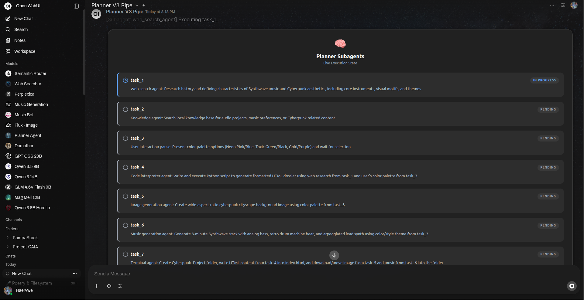
*Real-time monitoring of subagent tasks and planning progress.*

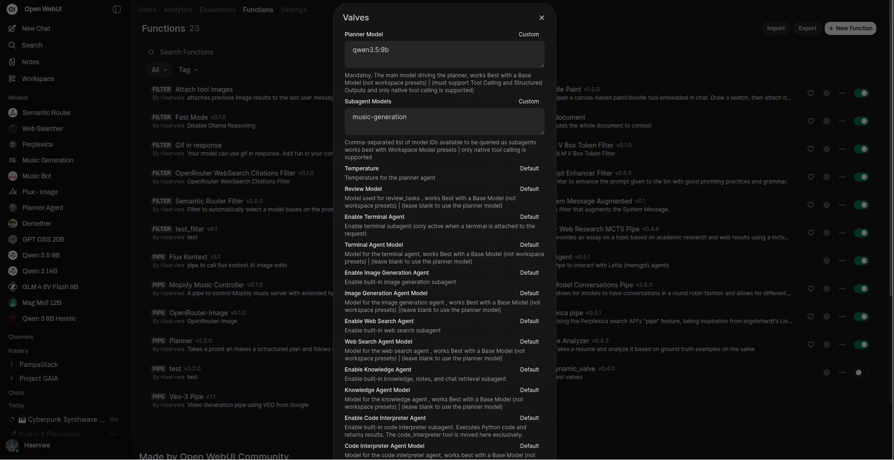
*Extensive configuration options to tailor the agentic behavior.*

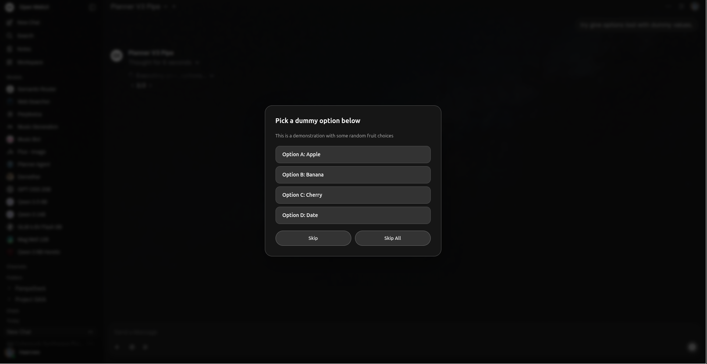
*Autonomous agents requesting user choice through interactive UI modals.*

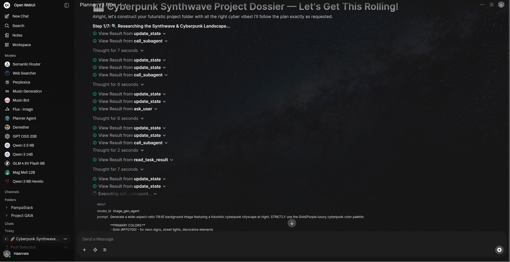
*Deep visibility into the agent's reasoning process and tool interactions.*

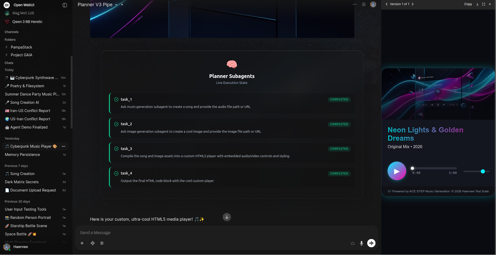
*Final output synthesis leveraging specialized subagents (e.g., Music Generation & HTML Layout).*

---

### arXiv Research MCTS Pipe

### Description

Search arXiv.org for relevant academic papers and iteratively refine a research summary using a Monte Carlo Tree Search (MCTS) approach.

### Configuration

- `model`: The model ID from your LLM provider
- `tavily_api_key`: Required. Obtain your API key from tavily.com
- `max_web_search_results`: Number of web search results to fetch per query
- `max_arxiv_results`: Number of results to fetch from the arXiv API per query
- `tree_breadth`: Number of child nodes explored per MCTS iteration
- `tree_depth`: Number of MCTS iterations
- `exploration_weight`: Controls balance between exploration and exploitation
- `temperature_decay`: Exponentially decreases LLM temperature with tree depth
- `dynamic_temperature_adjustment`: Adjusts temperature based on parent node scores
- `maximum_temperature`: Initial LLM temperature (default 1.4)
- `minimum_temperature`: Final LLM temperature at max tree depth (default 0.5)

### Usage

- **Example:**

  ```python
  Do a research summary on "DPO laser LLM training"
  ```


*Example of arXiv Research MCTS Pipe output*

---

### Multi Model Conversations v2 Pipe

### Description

An advanced multi-model conversation system that enables interactive, multi-agent discussions with a custom configuration UI. Feature parity with the latest Open WebUI capabilities including tool support, reasoning tag handling (thinking blocks), and dynamic speaker management. Configure up to 5 participants with unique personas and models, and use the optional Group Chat Manager to orchestrate the discussion flow.

### Configuration

Version 2 introduces a sophisticated **Configuration Overlay** that allows you to set up your multi-agent conversation visually. It still supports **User Valves** for defaults, but the primary way to configure a chat is through the interactive UI.

**Key Features:**

- **Dynamic Speaker Selection**: Enables or disables the Group Chat Manager.
- **Model-Specific Prompts**: Set unique system messages for each participant.
- **Tool Integration**: Models can now use available tools within the conversation.
- **Reasoning Support**: Full support for "thinking" models with collapsible reasoning blocks.

**Core Settings:**

- `NUM_PARTICIPANTS`: Set the number of participants (1-5)
- `ROUNDS_PER_CONVERSATION`: Total rounds of replies in the conversation
- `UseGroupChatManager`: Enable dynamic speaker selection by a manager model

**Per-Participant Configuration:**

- `Participant[1-5]Model`: Model for each participant
- `Participant[1-5]Alias`: Display name for each participant
- `Participant[1-5]SystemMessage`: Persona and instructions for each participant

### Accessing the Configuration UI

To configure the conversation:

1. **Select the Pipe**: Choose "Multi Model Conversations v2 Pipe" as your model.
2. **Open Configuration**: Click the **settings icon** (list icon in a new message) in the chat input area OR look for the **Configuration Overlay** that appears when starting a new chat.
3. **Configure agents**: Set your models, aliases and system prompts.
4. **Save and Start**: Click "Start Conversation" to begin the multi-agent session.

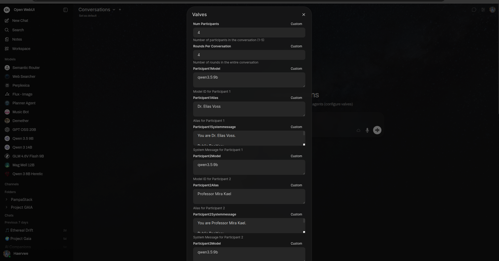
*Example of Multi Model Conversations User Valves configuration panel*

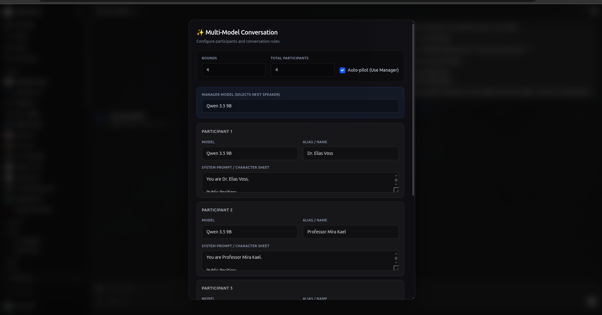
*Example of Multi Model Conversations Setup Popup*

### Video Demos


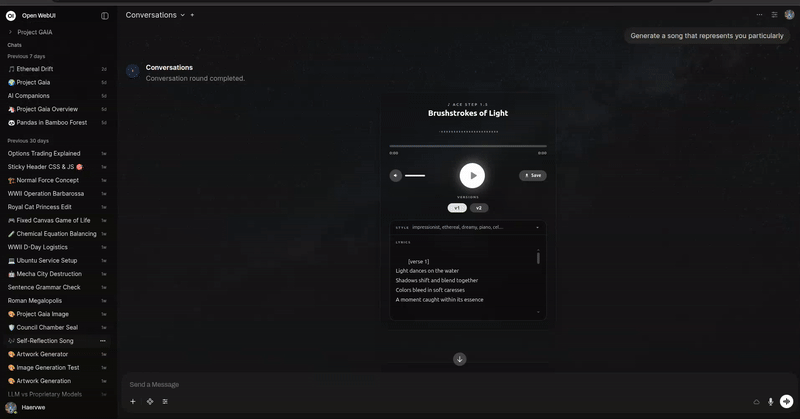

### Usage

- **Example:**

  ```python
  Start a conversation between three AI agents about climate change.
  ```

**Use Cases:**

- **Debates:** Set up opposing viewpoints (optimist vs. skeptic)
- **Brainstorming:** Multiple creative perspectives on a problem
- **Role-playing:** Interactive storytelling with multiple characters
- **Analysis:** Different analytical approaches to the same topic
- **Expert Panels:** Simulate domain experts discussing a complex issue

---

### Resume Analyzer Pipe

### Description

Analyze resumes and provide tags, first impressions, adversarial analysis, potential interview questions, and career advice.

### Configuration

- `model`: The model ID from your LLM provider
- `dataset_path`: Local path to the resume dataset CSV file
- `rapidapi_key` (optional): For job search functionality
- `web_search`: Enable/disable web search for relevant job postings
- `prompt_templates`: Customizable templates for all steps

### Usage

1. **Requires the Full Document Filter** (see below) to work with attached files.
2. **Example:**

  ```python
Analyze this resume:
[Attach resume file]
  ```


*Screenshots of Resume Analyzer Pipe output*

---

### Mopidy Music Controller

### Description

Control your Mopidy music server to play songs from the local library or YouTube, manage playlists, and handle various music commands. This pipe provides an intuitive interface for music playback, search, and playlist management through natural language commands.

**⚠️ Requirements**: This pipe requires [Mopidy-Iris](https://github.com/jaedb/Iris) to be installed for the player interface. Iris provides a beautiful, feature-rich web interface for controlling Mopidy.

### Configuration

- `model`: The model ID from your LLM provider
- `mopidy_url`: URL for the Mopidy JSON-RPC API endpoint (default: `http://localhost:6680/mopidy/rpc`) - Iris UI must be installed
- `youtube_api_key`: YouTube Data API key for search functionality
- `temperature`: Model temperature (default: 0.7)
- `max_search_results`: Maximum number of search results to return (default: 5)
- `system_prompt`: System prompt for request analysis

### Prerequisites

1. **Mopidy Server**: Install and configure [Mopidy](https://mopidy.com/)
2. **Mopidy-Iris**: Install the Iris web interface:
   ```bash
   pip install Mopidy-Iris
   ```
3. **Optional Extensions**:
   - Mopidy-Local (for local library)
   - Mopidy-YouTube (for YouTube playback)

### Usage

- **Example:**

  ```python
  Play the song "Imagine" by John Lennon
  ```

- **Quick text commands:** stop, halt, play, start, resume, continue, next, skip, pause

### Features

- **Natural Language Control**: Use conversational commands to control playback
- **YouTube Integration**: Search and play songs directly from YouTube
- **Local Library Support**: Access and play songs from your local Mopidy library
- **Playlist Management**: Create, modify, and manage playlists
- **Iris UI Integration**: Beautiful, professional web interface with full playback controls
- **Seamless Embedding**: Iris player embedded directly in Open WebUI chat interface


*Example of Mopidy Music Controller Pipe with Iris UI (v0.7.0)*

---

### Letta Agent Pipe

### Description

Connect with Letta agents, enabling seamless integration of autonomous agents into Open WebUI conversations. Supports task-specific processing and maintains conversation context while communicating with the agent API.

### Configuration

- `agent_id`: The ID of the Letta agent to communicate with
- `api_url`: Base URL for the Letta agent API (default: `http://localhost:8283`)
- `api_token`: Bearer token for API authentication
- `task_model`: Model to use for title/tags generation tasks
- `custom_name`: Name of the agent to be displayed
- `timeout`: Timeout to wait for Letta agent response in seconds (default: 400)

### Usage

- **Example:**

  ```python
  Chat with the built in Long Term memory Letta MemGPT agent.
  ```


*Example of Letta Agent Pipe*

---

### OpenRouter Image Pipe

### Description

An adapter pipe for the OpenRouter API that enables streaming, multi-modal chat completions with built-in websearch and image generation support. This pipe focuses on image generation capabilities and web search integration, with no support for external tools and streaming-only completions. Images are automatically saved to the Open WebUI backend and URLs are emitted for stable access.

### Configuration (Valves)

- `API_KEY` (str): OpenRouter API key (Bearer token)
- `ALLOWED_MODELS` (List[str]): List of allowed model slugs (only these models can be invoked by the pipe)
- `USE_WEBSEARCH` (bool): Enable the web search plugin globally or enable per-model by appending `:online` to the model id
- `USE_IMAGE_EMBEDDING` (bool): When True the pipe will emit generated images as HTML `` embeds; otherwise images are emitted as markdown links

### Features

- Streaming text deltas to the client in real-time (low-latency partial responses)
- Emits structured reasoning details when available from the model
- Saves base64 image responses to the Open WebUI files backend and returns stable URLs (with cache-busting timestamps)
- Built-in websearch integration for enhanced responses
- Model capability detection (queries OpenRouter models endpoint to find supported modalities and adapts payloads automatically)
- No support for external tools - focused on core image generation and websearch functionality

### Usage

Copy `functions/openrouter_image_pipe.py` into your Open WebUI Functions and enable it in your workspace. The pipe registers ids in the format `openrouter-<model>-pipe` (for example: `openrouter-openai/gpt-4o-pipe`). When invoked it will stream messages/events back to the Open WebUI frontend using the event emitter API.

Example:

```python
   "Explain this image"
```
```python
   "Web search recent news about Argentina and make an image about it"
```

### Example screenshots

Below are example screenshots showing the pipe in action inside Open WebUI — streaming assistant text, vision-capable model input/output, and generated images.


*Example: image generation with websearch integration.*

---

### OpenRouter WebSearch Citations Filter

### Description

Enables web search for OpenRouter models by adding plugins and options to the request payload. This filter provides a UI toggle to use OpenRouter's native websearch with proper citation handling. It processes web search results and emits structured citation events for proper source attribution in Open WebUI.

### Configuration (Valves)

- `engine` (str): Web search engine - "auto" (automatic selection), "native" (provider's built-in), or "exa" (Exa API)
- `max_results` (int): Maximum number of web search results to retrieve (1-10)
- `search_prompt` (str): Template for incorporating web search results. Use `{date}` placeholder for current date.
- `search_context_size` (str): Search context size - "low" (minimal), "medium" (moderate), "high" (extensive)

### Features

- UI toggle for enabling web search on OpenRouter models
- Automatic citation generation with markdown links using domain names
- Structured citation events for Open WebUI integration
- Flexible search engine selection (auto, native, or Exa)
- Configurable search result limits and context size
- Real-time status updates during search execution

### Usage

Copy `filters/openrouter_websearch_citations_filter.py` into your Open WebUI Filters and enable it in your model configuration. The filter will add web search capabilities to OpenRouter models with proper citation handling.

Example search prompt template:
```
A web search was conducted on {date}. Incorporate the following web search results into your response.
IMPORTANT: Cite them using markdown links named using the domain of the source.
Example: [nytimes.com](https://nytimes.com/some-page).
```

The filter processes annotations in the response stream and emits citation events with source URLs, titles, and metadata for each web search result.

## 🔧 Filters

### Doodle Paint Filter

### Description

Toggleable filter that opens a paint canvas before sending each message, letting you attach a hand-drawn sketch to your prompt. Perfect for visually explaining concepts, requesting changes to UI drafts, or adding a personal touch to your AI interactions.

### Features

- **Integrated Canvas**: Opens a sleek, fullscreen paint canvas directly within your Open WebUI space.
- **Rich Tools**: Includes a pen, eraser, color palette, custom color picker, brush size adjustment, clear canvas, and undo/redo functionality.
- **Native Persistence**: Uses Open WebUI's native `Chats` model so generated doodles permanently attach to the user's message body, persisting seamlessly across the entire conversation history instead of as hacky assistant attachments.

### Usage

1. **Enable the Filter**: Turn on the Doodle Paint filter within your model configuration or parameters.
2. **Send a Message**: Type your message and hit send.
3. **Draw**: A beautiful fullscreen Doodle Paint canvas will automatically appear. Draw your sketch!
4. **Attach**: Click **✔ Attach & Send** to append the drawing to your message (or "Skip" to send text-only).


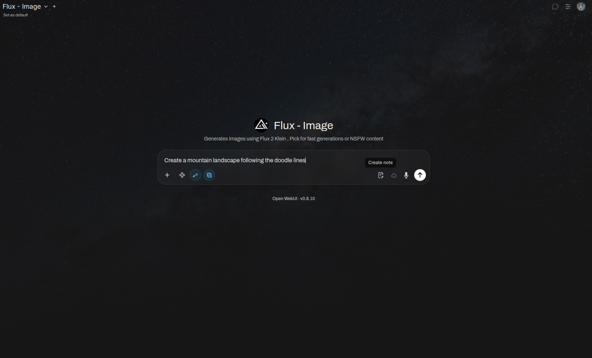
*Sending a promt triggers the doodle paint canvas if active*


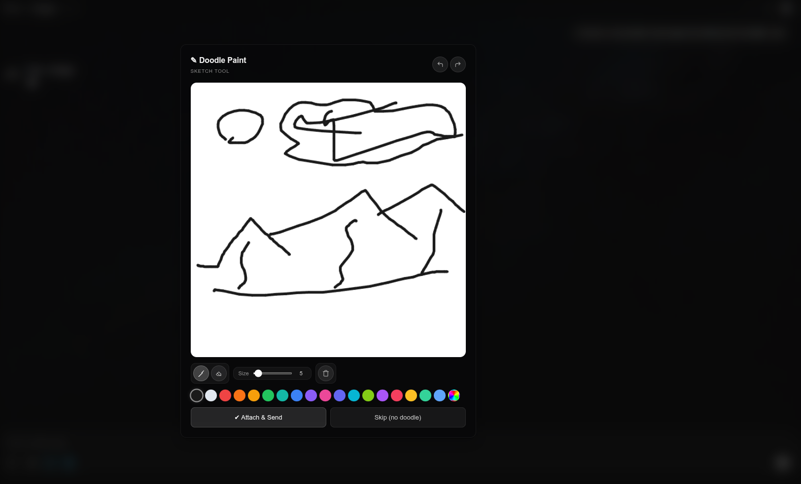
*Fullscreen paint canvas overlay*


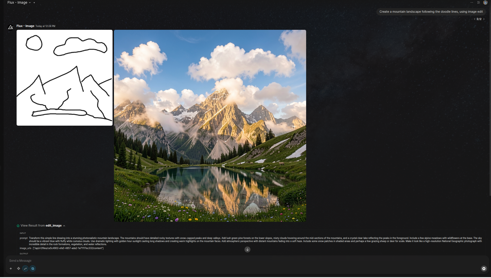
*Final interaction with the AI model*

---

### Prompt Enhancer Filter

### Description

Uses an LLM to automatically improve the quality of your prompts before they are sent to the main language model.

### Configuration

- `user_customizable_template`: Tailor the instructions given to the prompt-enhancing LLM
- `show_status`: Displays status updates during the enhancement process
- `show_enhanced_prompt`: Outputs the enhanced prompt to the chat window
- `model_id`: Select the specific model to use for prompt enhancement

### Usage

- Enable in your model configuration's filters section.
- Toggle the filter on or off as needed in chat settings.
- The filter will automatically process each user message before it's sent to the main LLM.


---


### Semantic Router Filter

### Description

Acts as an intelligent model router that analyzes the user's message and available models, then automatically selects the most appropriate model, pipe, or preset for the task. Features vision model filtering, **dynamic vision re-routing**, conversation persistence, knowledge base integration, and robust file handling with Open WebUI's RAG system.

The filter uses an innovative invisible text marker system to persist routing decisions across conversation turns. When a model is selected, the filter emits zero-width unicode characters in the first assistant message. These markers are **invisible to the LLM** (stripped before processing) but persist in the chat database, ensuring the same model, tools, and knowledge bases are used throughout the entire conversation without requiring metadata or system message manipulation.

The filter automatically detects when images are added to an existing conversation and intelligently re-routes to a vision-capable model if the current model lacks vision support. This enables seamless transitions from text-only conversations to image-based interactions without manual model switching.


### Configuration Valves

- **vision_fallback_model_id**: Fallback model for image queries when no vision-capable models are available
- **banned_models**: List of model IDs to exclude from routing selection
- **allowed_models**: List of model IDs to whitelist (when set, only these models will be considered)
- **router_model_id**: Specific model to use for routing decisions (leave empty to use current model)
- **system_prompt**: System prompt for the router model (customizable)
- **disable_qwen_thinking**: Append `/no_think` to router prompt for Qwen models
- **show_reasoning**: Display routing reasoning in chat
- **status**: Show status updates in chat
- **debug**: Enable debug logging

### Features

- **Conversation Persistence**: Routes only on first user message, then automatically maintains the selected model throughout the conversation using invisible text markers
- **Dynamic Vision Re-Routing**: Automatically detects when images are added mid-conversation and re-routes to a vision-capable model if the current model lacks vision support
- **Vision Model Filtering**: Automatically filters model selection to only vision-capable models when images are detected in the conversation (checks `meta.capabilities.vision` flag)
- **Smart Fallback**: Uses `vision_fallback_model_id` only when no vision models are available in the filtered list
- **Knowledge Base Integration**: Properly handles files from knowledge collections with full RAG retrieval support
- **Tool Preservation**: Maintains model-specific tools across conversation turns
- **File Structure Compliance**: Passes files in correct INPUT format to Open WebUI's `get_sources_from_items()` for proper RAG processing
- **Whitelist Support**: Use `allowed_models` to restrict selection to specific models only
- **Cross-Backend Compatibility**: Automatically converts payloads between OpenAI and Ollama formats when routing between different backend types
- **Automatic Fallback**: Gracefully handles errors by falling back to the original model

### Usage

1. Enable in your model configuration's filters section
2. Configure `vision_fallback_model_id` to specify a fallback model for image queries
3. Optionally set `allowed_models` to create a whitelist of preferred models, or use `banned_models` to exclude specific ones
4. The filter will automatically:
   - Route on the first user message only (analyzes task requirements and available models)
   - Emit an invisible marker that persists the routing decision in chat history
   - Detect and restore routing on subsequent messages in the conversation
   - **Re-route dynamically when images are added to a conversation if the current model lacks vision capability**
   - Detect images in conversations and filter to vision-capable models when present
   - Preserve the selected model's tools and knowledge bases throughout the conversation
   - Attach relevant files from knowledge collections with proper RAG retrieval
   - Convert payloads between OpenAI and Ollama formats as needed

### How It Works

**First Message (Routing):**

1. Analyzes user message and available models
2. Filters to vision-capable models if images are detected
3. Routes to the best model for the task
4. Emits invisible unicode marker (e.g., `​‌‍⁠model-id​‌‍⁠`) in first assistant message
5. Preserves model's tools, knowledge bases, and configuration

**Subsequent Messages (Persistence):**

1. Detects invisible marker in conversation history
2. Extracts persisted model ID
3. **Checks if images are present but current model lacks vision capability** ⭐ NEW
4. If vision mismatch detected, triggers fresh routing with vision filter
5. Otherwise, reconstructs full routing (model + tools + knowledge + metadata)
6. Strips marker from message content (invisible to LLM)
7. Continues conversation with same model and configuration

**Dynamic Vision Re-Routing Example:**

```
User: "Explain quantum physics"
→ Router selects text model (e.g., llama3.2:latest)

User: "Thanks! Now what's in this picture?" [attaches image]
→ Filter detects: images present + current model lacks vision
→ Automatically triggers re-routing with vision filter
→ Router selects vision model (e.g., llama3.2-vision:latest)
→ Vision model processes image and responds
```

### How Vision Filtering Works

When images are detected in the conversation:

1. Filter checks all available models for `meta.capabilities.vision` flag
2. Only vision-capable models are included in the routing selection
3. If no vision models are found, uses `vision_fallback_model_id` as fallback
4. Router model receives images for contextual routing decisions
5. If router model doesn't support vision, automatically switches to vision fallback for routing


---

### Full Document Filter

### Description

Allows Open WebUI to process entire attached files (such as resumes or documents) as part of the conversation. Cleans and prepends the file content to the first user message, ensuring the LLM receives the full context.

### Configuration

- `priority` (int): Priority level for the filter operations (default: `0`)
- `max_turns` (int): Maximum allowable conversation turns for a user (default: `8`)

#### User Valves

- `max_turns` (int): Maximum allowable conversation turns for a user (default: `4`)

### Usage

- Enable the filter in your model configuration.

- When you attach a file in Open WebUI, the filter will automatically clean and inject the file content into your message.

- No manual configuration is needed for most users.

- **Example:**

  ```python
  Analyze this resume:
  [Attach resume file]
  ```

---


## Clean Thinking Tags Filter

### Description

Checks if an assistant's message ends with an unclosed or incomplete "thinking" tag. If so, it extracts the unfinished thought and presents it as a user-visible message.

### Configuration

- No configuration required.

### Usage

- Works automatically when enabled.

---


## 🎨 Using the Provided ComfyUI Workflows

### Importing a Workflow

1. Open ComfyUI.
2. Click the "Load Workflow" or "Import" button.
3. Select the provided JSON file (e.g., `ace_step_api.json` or `flux_context_owui_api_v1.json`).
4. Save or modify as needed.
5. Use the node numbers in your Open WebUI tool configuration.

### Best Practices

- Always check node numbers after importing, as they may change if you modify the workflow.
- You can create and share your own workflows by exporting them from ComfyUI.


### Why this matters

This approach allows you to leverage state-of-the-art image and music generation/editing models with full control and customization, directly from Open WebUI.

---

## 📦 Installation

### From Open WebUI Hub (Recommended)

- Visit [https://openwebui.com/u/haervwe](https://openwebui.com/u/haervwe)
- Click "Get" for desired tool/pipe/filter.
- Follow prompts in your Open WebUI instance.

### Manual Installation

- Copy `.py` files from `tools/`, `functions/`, or `filters/` into Open WebUI via the Workspace > Tools/Functions/Filters section.
- Provide a name and description, then save.

---

## 🤝 Contributing

Feel free to contribute to this project by:

1. Forking the repository
2. Creating your feature branch
3. Committing your changes
4. Opening a pull request

---

## 📄 License

MIT License

---

## 🙏 Credits

- Developed by Haervwe
- Credit to the amazing teams behind:
  - [Ollama](https://github.com/ollama/ollama)
  - [Open WebUI](https://github.com/open-webui/open-webui)
  - [ComfyUI](https://github.com/comfyanonymous/ComfyUI)
  - [Perplexica](https://github.com/ItzCrazyKns/Perplexica)
  - [Letta](https://github.com/letta-ai/letta)
  - [Mopidy](https://github.com/mopidy/mopidy)
  - [Mopidy-Iris](https://github.com/jaedb/Iris)
  - [SearXNG](https://github.com/searxng/searxng)
- And all model trainers out there providing these amazing tools.


### Contributors
- [Adriaan Knapen](https://github.com/AKnapen)
- [Ampersandru](https://github.com/ampersandru)
- [Florian Euler](https://github.com/FlorianEuler)
- [Hristo Karamanliev](https://github.com/karamanliev)
- [iChristGit](https://github.com/iChristGit)
- [Ikko Eltociear Ashimine](https://github.com/eltociear)
- [rahxam](https://github.com/rahxam)
- [Tan Yong Sheng](https://github.com/tan-yong-sheng)
- [The JSN](https://github.com/The-JSN)
- [Zed Unknown](https://github.com/ZedUnknown)


### Security Audit
- [Haoyu Wang](https://github.com/LeaveerWang)
- [Rui Yang](https://github.com/BrookeYangRui)
---

## 🎯 Usage Examples

### Academic Research

```python
# Search for recent papers on a topic
Search for recent papers about "large language model training"

# Conduct comprehensive research
Do a research summary on "DPO laser LLM training"
```

### Creative Projects

```python
# Generate images
Create an image of "beautiful horse running free"

# Create music
Generate a song in the style of "funk, pop, soul" with lyrics: "In the shadows where secrets hide..."

# Edit images
Edit this image to look like a medieval fantasy king, preserving facial features
```

### Productivity

```python
# Analyze documents
Analyze this resume: [Attach resume file]

# Plan complex tasks
Create a fully-featured Single Page Application (SPA) for Conway's Game of Life
```

### Multi-Agent Conversations

```python
# Start group discussions
Start a conversation between three AI agents about climate change
```

---

## 🌟 Community & Ecosystem

This collection is part of the broader Open WebUI ecosystem. Here's how you can get involved:

- **🔗 Open WebUI Hub**: Discover more tools at [openwebui.com](https://openwebui.com)
- **📚 Documentation**: Learn more about Open WebUI at [docs.openwebui.com](https://docs.openwebui.com)
- **💡 Ideas**: Share your ideas and feature requests
- **🐛 Bug Reports**: Help improve the tools by reporting issues
- **🌟 Star the Repository**: Show your support by starring this repo

---

## 💬 Support

For issues, questions, or suggestions, please open an issue on the GitHub repository.
